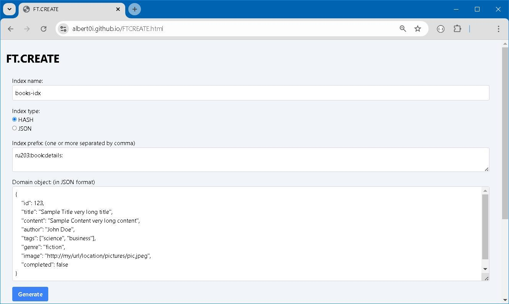

### [FTCREATE Helper](https://albert0i.github.io/FTCREATE.html)

FTCREATE Helper is a small utility facilitates to create `FT.CREATE` command in Redis. Most of the functionality are show in this example. 

Just paste in domain object in JSON format and press `Generate`. 

### EOF (2024/08/30)
